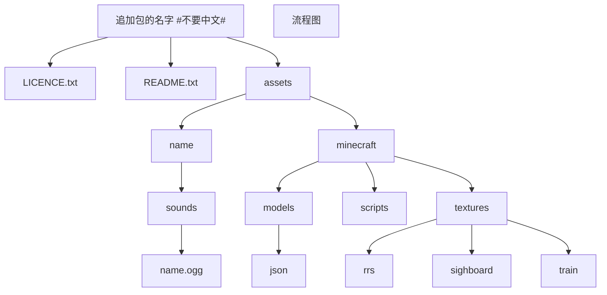
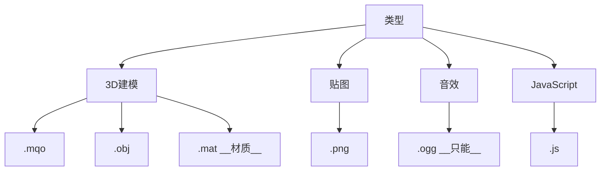
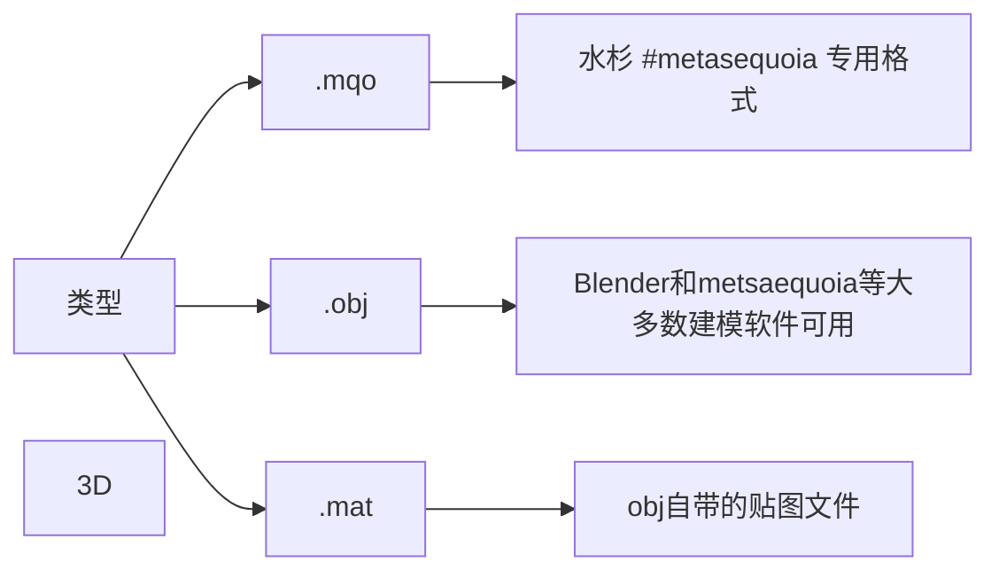
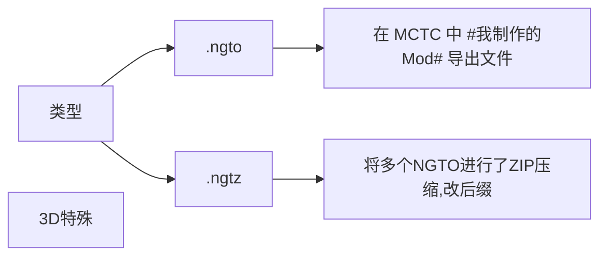
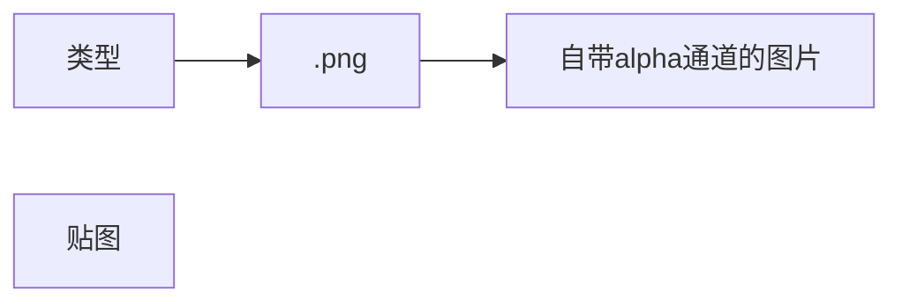
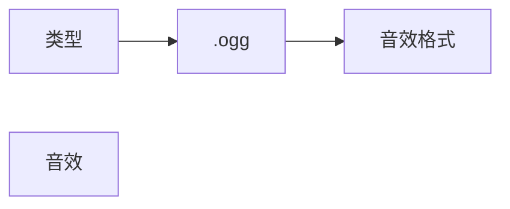
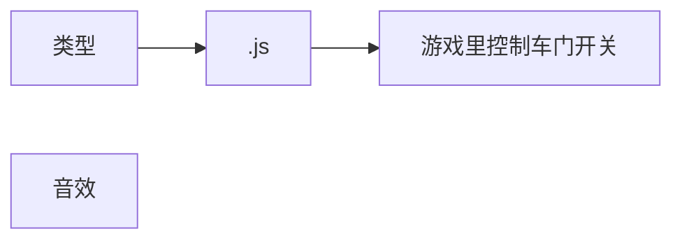

# 怎么制作RTM的追加包

-----------------

###### ~~教不会算我输~~

# 目录
## 1.创建追加包(基础)[P1][P1]
> ### 1.1zip结构图[p1.1][##### __P1.1__文件目录]
> > #### __P1.1.1__图片示例[p1.1.1][##### __P1.1.1__图片示例]
> ### __P1.2__支持格式[p1.2][##### __P1.2__支持格式]
> > #### __P1.2.1__介绍[p1.2.1][##### __P1.2.1__备注]
> > #### __P1.2.1__图片示例[p1.2.2][##### __P1.2.2__图片示例]
>
> ### __P1.3__图片纹理[p1.3][##### __P1.3__图片纹理]
> ### __P1.4__声音追加[p1.4][##### __P1.4__声音追加]
## 2.模型[P2][P2]

##### __P1.1__文件目录

##### __P1.1.1__图片示例

# ------------------------------------------------------------------------

---
---------------
---
##### __P1.2__支持格式

# ------------------------------------------------------------------------
##### __P1.2.1__备注

---
---------------
---

---
---------------
---

---
---------------
---

---
---------------
---

# ------------------------------------------------------------------------
##### __P1.2.2__图片示例

# ------------------------------------------------------------------------
##### __P1.3__图片纹理
	可参考assets/miecraft/textures/tarin/(# 不固定)/button_neme.png
	       外框=256px × 256px   按钮=160 × 32

                                      操作和创建步骤如下 

​                                                                                   软件AI 2018 CC pro

​                                                                           有不明白的加QQ群387092893

​                                                                                        新建button_test 

​                                                                       使用矩形工具在AI里创建106 × 32的灰色 

​                                                                                      加上亿点细节——成果

##  导出

# 画质高可能会导致游戏崩溃

##### __P1.4__声音追加

#                                   **to be continued**  